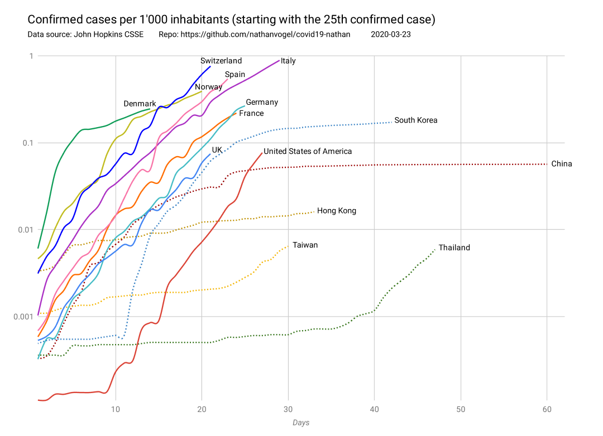

# My Covid-19 data playground

A playground to experiment with data around Covid-19



Data source: 2019 Novel Coronavirus COVID-19 (2019-nCoV) Data Repository by Johns Hopkins CSSE

Requirements:

```
npm i -g typescript
```

Setup:

```
git clone https://github.com/CSSEGISandData/COVID-19.git
yarn install
```

Run:

```
tsc && node compile_daily_reports.js
```

[Additionnal data processing on Google Sheets](https://docs.google.com/spreadsheets/d/13dAdiodtr0bOOCBmb1-w5mEjXg5f_lh5dEwJsOg3x6g/edit?usp=sharing)

## LICENSE

This project is licensed under the terms of the MIT license.
Copyright 2020 Nathan Vogel
